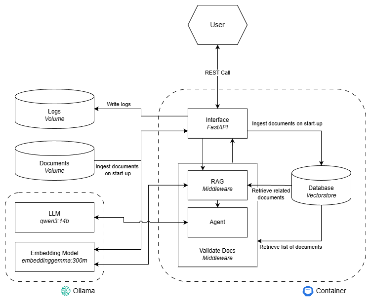

# TestCaseLLM
## Setup
### Install required tools
#### 1) Install Docker
Download and install Docker Desktop: https://www.docker.com/get-started/

#### 2) Install and setup Ollama
Download and install Ollama: https://ollama.com/download \
Once Ollama has been installed pull the required models. 
```
ollama pull qwen3:14b
ollama pull embeddinggemma:300m
```
In the default setup we use the "qwen3:14b" llm model and the "embeddinggemma:300m" embeddings model.
**If you wish to use different models please specify them in the .env file.**

#### 3) Setup test requirements
Install the required packages for the test, the use of a virtual environment is recommended.
```
pip install --no-cache-dir -r test/requirements_test.txt
```

### Run agent
1) Make sure Docker Desktop is running
2) Make sure ollama is running: 
```
ollama serve
```
3) Start agent container:
```
 docker-compose up
```
4) The Policy Q&A Agent has a REST API interface, 
once the container is running the documentation of the API is available at: http://localhost:8000/docs
(assuming default settings)

### Evaluate agent
The agent can be evaluated using pytest as follows:
1) Make sure Docker Desktop is running
2) Make sure ollama is running: 
```
ollama serve
```
3) Run pytest:
```
pytest
```
_The test will spin up the container automatically._

## Architecture


### Agent
The Policy Q&A Agent has been developed using a 2-step RAG architecture, as it is a requirement that the agent only 
answers questions using the information in the documents a forced document retrieval step makes sure the agent receives 
documents as context. The alternative would be a RAG as a tool for the model, but this would make the retrieval of 
documents, as context, optional, which is unwanted. The RAG step has been implemented as middleware, within the
LangChain framework focused on agents, set to run before the model/agent. Within this step the top 3 documents similar 
to the user prompt are retrieved from the vector database and added as context to the prompt. The current implementation
is simple, but offers a good foundation to improve with a lot of flexibility.
\
\
The "Agent" part itself has been kept simple and just calls the LLM model using the system prompt and the context added 
by the RAG middleware. 
\
\
The last step of the Agent is a validation of the documents used, provided by the model. These document names are 
validated against the document names retrieved from the vector database. If a document name does not exist we know the
model/agent has hallucinated. In case no documents are returned by the model/agent, we can conclude the model could not
answer based on the documents present in the database. In both cases we return a standard response: \
_"I am sorry I could not find any information related to your question."_ \
This could be further improved by implementing retries. Different output validation should be implemented as separate
middleware.

### Vector Database
The vectorstore is currently implemented as a InMemoryVectorStore, this for simplicity and speed of implementation for 
this test case. For a production implementation an external vectorstore is needed for persistent storage.
\
\
Currently the data ingestion into the vectorstore is done before the start-up of the API server, as a InMemoryVectorStore
is used. If an external vectorstore would be implemented I would suggest to implement the document ingestion into the
vector store in a dedicated container, which would also allow to keep the vectorstore updated independent of the 
Policy Q&A Agent.

### Logger
The logger is focused on the API Server, user requests, and responses. The logging is mainly focused to be able to use
the data for further improvement/development of the agent. Currently, the logging focuses on readability, but this can 
easily be changed.


## Time allocation
I spent more time than the target effort of 3-4 hours. I spent around 12 hours, this mainly because I enjoyed 
implementing/learning the new middleware functionality within the LangChain framework and because I wanted to setup a good
base that could be used as a foundation for further developments. 